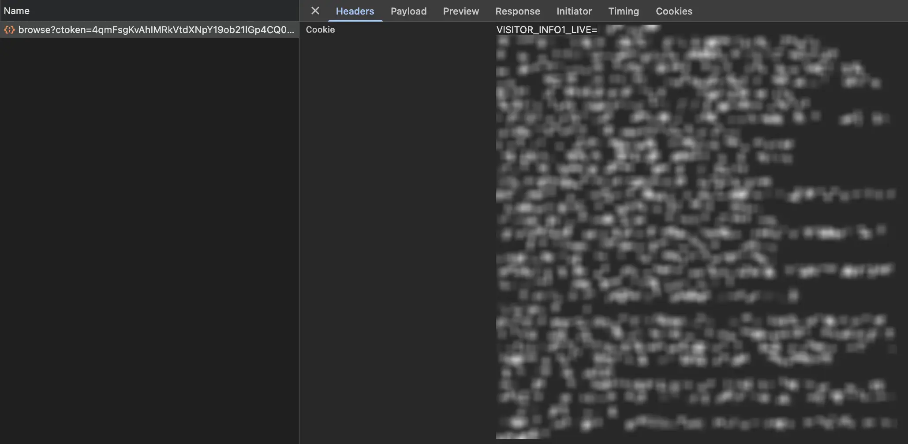

# Webiwavo

## How to test

Currenttly the project contains a `.env.example`, the first step is create a `.env` file, in that file you have to copy the variable `TEST_COOKIE`, then you need to specify the cookie for visualize the components according to your feed, for get the cookie, the easiest way is:

- Open a private tab in your browser
- Go to [youtube music](https://music.youtube.com)
- Open de developer tools (inspect an element or f12)
- In the developer tools go to `Network` tab
- Log in on youtube music with your google account
- In the search bar in the `Network` tab search `browse?` 
- Scroll down until find the cookie fild and copy the entire value in the .env variable

This is an example of the cookie in Chrome Browser

Once you maded the process for get the cookie you can test executing the app with `just` command

